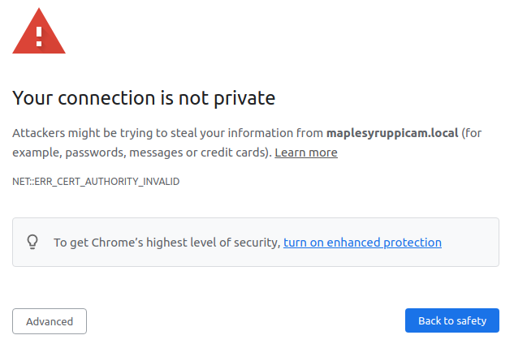
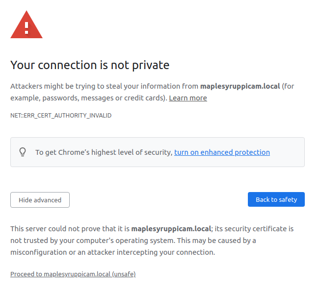
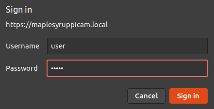
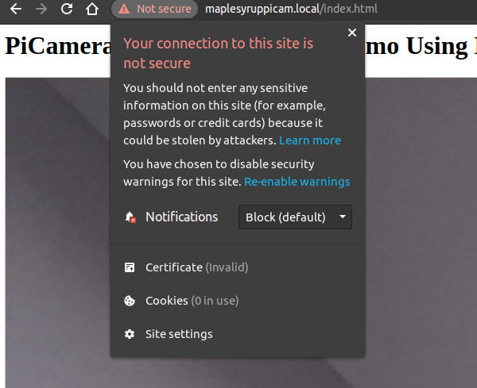
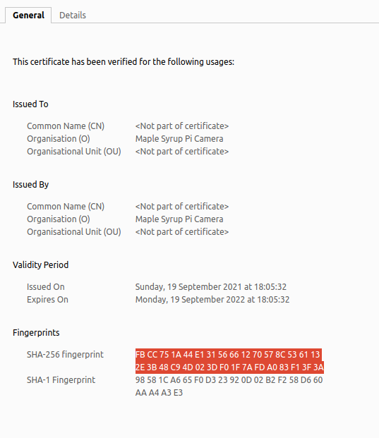

# RPI streaming video from its camera using https and user/password
RPI streaming video from its camera using https and user/password to make it **less** insecure.  
# Disclaimer: 
**Use it at your own risk as I take no responsibility for anything that could result from using the code in this repo! I'm mostly documenting it for my future self... (it's public because I may want to access it from a public computer without the need of using my github account/password)** 

# How to use it
## Clone this repository inside ```/home/pi```
```
git clone https://github.com/ricardodeazambuja/rpi_camera_streaming_https_password.git
```

## Create your own certificate (must be saved inside the same directory where you cloned the repo):
```openssl req -new -x509 -keyout localhost.pem -out localhost.pem -days 365 -nodes```

## Change the user:password 
Inside ```rpi_camera_streaming_https_password.sh```, change ```user:pass``` to whatever you fancy, but it must follow that pattern with the colon separating both.

### Don't forget to change the default password of your Raspberry Pi to something else!
Using the command line:
```
passwd pi
```

## Manual launch 
Just execute ```./rpi_camera_streaming_https_password.sh```.

If you are using the [Maple Syrup Pi Camera](https://github.com/ricardodeazambuja/Maple-Syrup-Pi-Camera), you just need to open your web browser and access:  
```https://maplesyruppicam.local/```

Your browser will be annoyed about the certificare and it will say the connection is not private:



Click on ```Advanced```:



Finally click on ```Proceed to...```. Your browser will show you a dialog box asking for the user and password.



And that's it. You should see the stream from your Raspberry Camera.
## To make it a service that is always running:
```
sudo cp rpi_camera_streaming_https_password.service /lib/systemd/system/rpi_camera_streaming_https_password.service
sudo chmod 644 /lib/systemd/system/rpi_camera_streaming_https_password.service
sudo systemctl daemon-reload
sudo systemctl enable rpi_camera_streaming_https_password.service
sudo reboot now
```

## To stop the service
```
sudo systemctl stop rpi_camera_streaming_https_password.service
```

## To disable the service
```
sudo systemctl disable rpi_camera_streaming_https_password.service
```

## To follow logs in real time:
```
sudo journalctl -f -u rpi_camera_streaming_https_password
```

# How to check the certificate is really yours since the browser can't check it with a certificate authority?

In your Raspberry Pi, same directory where you cloned this repo and created your certificate:
```
openssl x509 -in localhost.pem -noout -sha256 -fingerprint
```

Then, in your browser:





Compare if they match. [Nice collection of hints about openssl use](https://techglimpse.com/linux-openss-toolkit-example-commands/).

# If you are crazy enough to want to access the camera stream from outside a private network:
Check [ngrok instructions](https://ngrok.com/docs#http-local-https) (untested because I'm not that crazy...).

# Useful links:
* https://www.raspberrypi.org/documentation/computers/configuration.html
* https://www.freebsd.org/cgi/man.cgi?wpa_supplicant.conf(5)
* https://www.freebsd.org/cgi/man.cgi?query=wpa_passphrase

# Based on / using ideas from: 
- [Picamera Web streaming example](https://picamera.readthedocs.io/en/release-1.13/recipes2.html#web-streaming)
- [SimpleHTTPAuthServer](https://github.com/tianhuil/SimpleHTTPAuthServer/)
- [And, of course, stackoverflow (lol)](https://stackoverflow.com/questions/19705785/python-3-simple-https-server)
